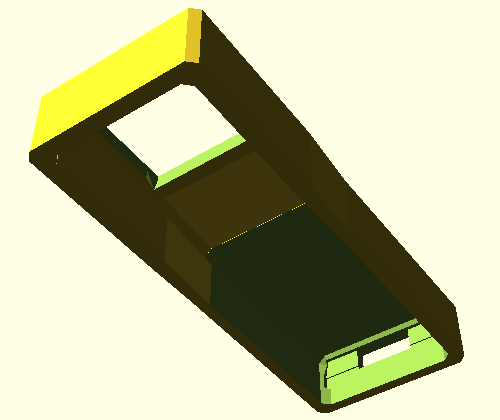
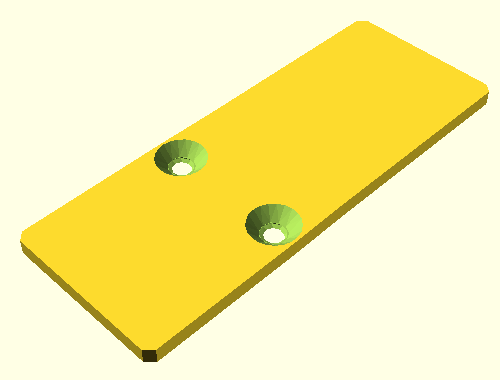
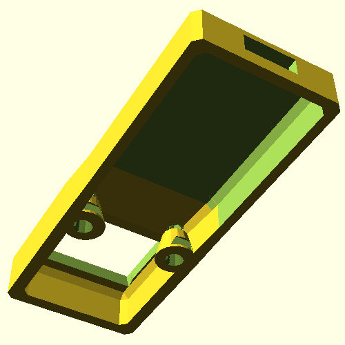

<!--This document was generated. Edit the source files under “resources/butty”, not this file.-->
# Tutorial: Butty the single-button keyboard (part 5)

This article continues from [part 4](tutorial-1d.md) and concludes the
tutorial.



⤤ At the end of part 4, Butty was looking fairly finished. You could print this
piece, wire it up and use it. However, anybody who flipped Butty over on its
back would see the electronics exposed to the elements, and there’d be nothing
bracing the MCU for the force of plugging in a USB cable. This time we’re
solving those problems.

A [butty](https://en.wiktionary.org/wiki/butty) is a sandwich, so our solution
will consist of a bottom plate to close the case.

## Including the plate

Change `butty.yaml` to contain this:

```yaml
key-clusters:
  main:
    anchoring:
      extrinsic-offset: [0, 0, 10]
    aliases:
      k: [0, 0]
by-key:
  parameters:
    wall:
      extent: 1
      to-ground: true
  sides:
    NNE:
      parameters:
        wall:
          extent: 0
          to-ground: false
    NNW:
      parameters:
        wall:
          extent: 0
          to-ground: false
main-body:
  rear-housing:
    include: true
    anchoring:
      extrinsic-offset: [0, 32, 0]
    size: [22, 30, 9]
    thickness:
      walls: 1.5
      roof: 1.5
  bottom-plate:
    include: true
bottom-plates:
  thickness: 2
mcu:
  include: true
  anchoring:
    anchor: rear-housing-interior
    side: N
    segment: 1
    extrinsic-offset: [0, 0, -3]
tweaks:
  top-bridge:
  - chunk-size: 2
    hull-around:
    - hull-around:
      - [k, WNW, 1]
      - [rear-housing-interior, WSW, 1]
      - [rear-housing-exterior, WSW, 1]
    - hull-around:
      - [k, WNW]
      - [rear-housing-interior, WSW, 0]
      - [rear-housing-exterior, WSW, 0]
    - hull-around:
      - [k, ENE]
      - [rear-housing-interior, ESE, 0]
      - [rear-housing-exterior, ESE, 0]
    - hull-around:
      - [k, ENE, 1]
      - [rear-housing-interior, ESE, 1]
      - [rear-housing-exterior, ESE, 1]
  wall-bridges:
  - at-ground: true
    hull-around:
    - [k, WNW, 1]
    - [rear-housing-exterior, WSW, 1]
    - [rear-housing-interior, WSW, 1]
  - at-ground: true
    hull-around:
    - [k, ENE, 1]
    - [rear-housing-exterior, ESE, 1]
    - [rear-housing-interior, ESE, 1]
  bottom-bridge:
  - at-ground: true
    above-ground: false
    hull-around:
    - [k, WNW, 1]
    - [rear-housing-exterior, WSW, 1]
    - [rear-housing-exterior, ESE, 1]
    - [k, ENE, 1]
```

That’s everything we had at the end of the last part of this tutorial, plus
these new lines in the `main-body` section and right below it:

```yaml
  bottom-plate:
    include: true
bottom-plates:
  thickness: 2
```

This has a visible effect in `body-main.yaml`, cutting 2 mm off the bottom of
its wall to maintain a constant overall height. More importantly, the
application produces a whole new file of output, called
`bottom-plate-case.scad`. It looks something like this:


⤤ This is a bottom plate that will fit perfectly under Butty’s main body, but
there’s a hole in it. This is because the tweaks we created in the last part of
this tutorial cover the roof and walls, but they don’t tell the application
precisely where to fill in the floor. We’re going to fix that by adding another
tweak, at the very bottom of `butty.yaml`.

```yaml
  bottom-bridge:
  - at-ground: true
    above-ground: false
    hull-around:
    - [k, WNW, 1]
    - [rear-housing-exterior, WSW, 1]
    - [rear-housing-exterior, ESE, 1]
    - [k, ENE, 1]
```

⤤ This combination of `at-ground` with `above-ground` makes the tweak affect
the bottom plate but not the main body.


⤤ Smooth! Too smooth.

## Assembly

As our crowning achievement in this tutorial we will solve the last two of our
problems with one final change to our configuration file.

* We need some way to attach the bottom plate to the main body.
* We need to keep the MCU in position inside the closed case.

This is the complete configuration that will do the job:

```yaml
key-clusters:
  main:
    anchoring:
      extrinsic-offset: [0, 0, 10]
    aliases:
      k: [0, 0]
by-key:
  parameters:
    wall:
      extent: 1
      to-ground: true
  sides:
    NNE:
      parameters:
        wall:
          extent: 0
          to-ground: false
    NNW:
      parameters:
        wall:
          extent: 0
          to-ground: false
main-body:
  rear-housing:
    include: true
    anchoring:
      extrinsic-offset: [0, 32, 0]
    size: [22, 30, 9]
    thickness:
      walls: 1.5
      roof: 1.5
  bottom-plate:
    include: true
bottom-plates:
  thickness: 2
flanges:
  main-bottom-plate:
    include: true
    bolts:
      include: true
      bolt-properties:
        include-threading: true
    bosses:
      include: true
    positions:
    - anchoring:
        anchor: k
        side: NNW
        extrinsic-offset: [1.5, 1, 0]
    - anchoring:
        anchor: k
        side: NNE
        extrinsic-offset: [-1.5, 1, 0]
mcu:
  include: true
  anchoring:
    anchor: rear-housing-interior
    side: N
    segment: 1
    extrinsic-offset: [0, 0, -3]
tweaks:
  top-bridge:
  - chunk-size: 2
    hull-around:
    - hull-around:
      - [k, WNW, 1]
      - [rear-housing-interior, WSW, 1]
      - [rear-housing-exterior, WSW, 1]
    - hull-around:
      - [k, WNW]
      - [rear-housing-interior, WSW, 0]
      - [rear-housing-exterior, WSW, 0]
    - hull-around:
      - [k, ENE]
      - [rear-housing-interior, ESE, 0]
      - [rear-housing-exterior, ESE, 0]
    - hull-around:
      - [k, ENE, 1]
      - [rear-housing-interior, ESE, 1]
      - [rear-housing-exterior, ESE, 1]
  wall-bridges:
  - at-ground: true
    hull-around:
    - [k, WNW, 1]
    - [rear-housing-exterior, WSW, 1]
    - [rear-housing-interior, WSW, 1]
  - at-ground: true
    hull-around:
    - [k, ENE, 1]
    - [rear-housing-exterior, ESE, 1]
    - [rear-housing-interior, ESE, 1]
  bottom-bridge:
  - at-ground: true
    above-ground: false
    hull-around:
    - [k, WNW, 1]
    - [rear-housing-exterior, WSW, 1]
    - [rear-housing-exterior, ESE, 1]
    - [k, ENE, 1]
```

Here’s the new part, in the middle:

```yaml
flanges:
  main-bottom-plate:
    include: true
    bolts:
      include: true
      bolt-properties:
        include-threading: true
    bosses:
      include: true
    positions:
    - anchoring:
        anchor: k
        side: NNW
        extrinsic-offset: [1.5, 1, 0]
    - anchoring:
        anchor: k
        side: NNE
        extrinsic-offset: [-1.5, 1, 0]
```

Add that to `butty.yaml`, save it and run the application once more.




⤤ The change adds two internally threaded bosses for M3 screws inside the case.
It also adds countersinks for the same screws’ heads, which go into the bottom
plate.

The placement of each boss uses anchoring parameters, the same way we have seen
elsewhere, but automatically drops to the floor because of properties already
defined for `main-bottom-plate` in `base.yaml`.

Inside the case, there are notches cut into the two bosses. These notches are
made by the invisible model of the MCU’s circuit board. They show that the
bosses are properly aligned to support the MCU without preventing assembly.

## Summary

In this part of the tutorial we have learned:

* How to include a bottom plate for the main body.
* How to tweak the bottom plate without touching the main body.
* How to add fasteners for assembly.

This illustrated tour of some DMOTE application features is at an end.  Feel
free to modify the configuration further as you explore the
[options](options-main.md), or print a copy of Butty as is, for a hardcore 1%
keyboard experience.
